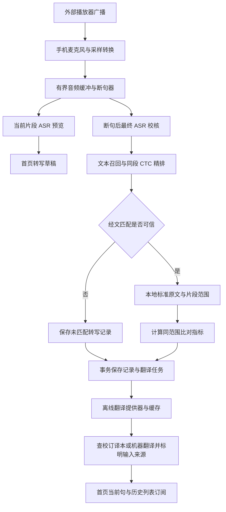

# 广播收音、经文匹配与离线翻译：CodeBuddy 实施方案

| 项目 | 内容 |
|---|---|
| 项目目录 | `/Users/llvision/Desktop/androidspace/quran_offline_demo` |
| 编制日期 | 2026-09-20 |
| 本文状态 | 需求与实现计划；本轮只产出方案，没有实现新首页、历史库或翻译功能 |
| 目标平台 | Android / iOS 真机；首期前台运行 |
| 用户已确认 | 外部广播麦克风收音、端侧转写与匹配；简体中文和英语；优先本地校订译本，未匹配时离线机器翻译，必须明确标记来源 |
| 基线 | 当前工作区，HEAD `313835695352ddb8dfed02ed13f5aeef6e9f4892`，有大量已验证但尚未提交的改动，必须保留 |
| 实施入口 | 配套临时交接文件 `/private/tmp/handoff-quran-broadcast-codebuddy-20260920.md` |

## 0. 最新决策（覆盖此前候选方案）

- 机器翻译固定 **ML Kit**；取消Hy-MT2、llama.cpp适配及候选竞选。
- 新广播功能从独立上游建立新库，首批第1章开端章7节、第67章王权章30节、第112章纯洁章4节。旧 `assets/quran_offline/quran.json`、旧索引和现有功能保留，禁止作为新功能的查询或隐藏回退来源。
- “不要用本机原文库”按“不复用现有原文库”落实；新库下载后仍存本机以实现离线。三章是首批范围，后续可扩展。
- 先前确认的校订译本优先规则保留，本次仅确定机器翻译引擎；没有授权译本时用ML Kit，明确机器翻译来源。
- [三章原文及音频资源清单](new-corpus-fatiha-ikhlas-20260920.md)是当前导入依据。已独立下载Tanzil原文、生成三章41节JSON，并下载王权章两份整章音频，完整解码通过；文件位于resources/broadcast_quran/，未接入App或修改运行代码。

## 1. 需求解释与交付边界

用户所说的“转写后的译文、古兰经原文、翻译目标文本”，在产品和代码中统一为三个独立字段，防止“转写”和“翻译”混用：

1. **识别转写**：手机实际听到并由 ASR 输出的阿拉伯语，允许存在错误，不得用经文库文本替换后冒充模型输出。
2. **匹配经文**：从本机经文库取得的阿拉伯语标准原文，带章、节编号。低可信时显示“尚未确认经文”，不能随便选择第一候选。
3. **目标译文**：匹配经文时优先查询本地校订译本；未匹配经文时翻译实际 ASR 转写。简体中文/英语及来源必须明确显示。匹配成功但该语言译本缺失时，采用标准原文的机器翻译并标明原因。

每次完成一个可解释的语音片段，形成一条持久记录，包含这三类文本、语言、匹配引用、比对指标、时间和状态。首页右上角显示历史入口及记录数量；列表有稳定序号，点击打开详情。首页与详情均按上、中、下排列三类文本，内容超出屏幕可纵向滚动。

### 首期明确包括

- 本机 microphone → 16 kHz 单声道 PCM → 离线 ASR → 本机经文匹配 → 端侧翻译 → 持久化。
- 简体中文 `zh-Hans` 和英语 `en`，源语言固定阿拉伯语 `ar`；默认中文，每条新记录只翻译创建时选定的一种目标语言。
- 独立新库三章共41节可用、离线模型准备状态、翻译失败可重试、历史列表和详情、原文与转写的逐词比对。
- 已匹配多节的片段可以包含多个经文引用，不能只取跨度首节。
- 同一节在广播中重复诵读，必须允许形成不同记录。
- 保留现有离线校核与流式诊断入口，移至“开发诊断”，不再充当产品首页。

### 首期不默认包括

- 系统内部播放音频捕获、电话通话录音、锁屏持续收音、后台常驻、自动语音播报、云翻译、用户账号/云同步。
- 逐词同声翻译或逐字滚动译文；首期为实时转写预览、片段确认后翻译。
- 对未匹配广播解说强行给出经文；保留其实际转写并离线机器翻译，原文为空，显示“未匹配经文；译文来自转写”。
- 同时显示两种目标语言。详情可追加另一语言版本，但不能覆盖原记录已有译文。

“每句话”不等于“一节经文”，也不等于每次 0.75 秒模型回调。本文把一句定义为**有独立音频时间范围的已确认语音片段**；长节中途停顿可以产生部分片段，多节连读也可以形成一个片段。必须显示匹配范围及完整性，不能把只听到半节写成整节已完整识别。

用户已确认默认策略 `editionPreferredWithMachineFallback`。经文匹配成功且目标译本可用时查本地译本；未匹配时对实际转写做离线机器翻译。具体译本版本与再分发权限仍需确定，不能把任意网络译文标作校订译本。机器翻译已选ML Kit；[此前GitHub调研](offline-translation-github-options-20260920.md)仅保留为历史资料。

## 2. 已核实的项目能力与缺口

### 2.1 可复用的现有实现

| 文件 / 类或方法 | 已有能力 | 实施注意 |
|---|---|---|
| `lib/main.dart::QuranOfflineDemoApp` | 当前 MaterialApp 入口 | 改指向新首页；旧 Demo 保留为诊断路由 |
| `quran_offline_demo_page.dart::_start/_stop/_log` | record 收音、权限、事件显示 | 收音生命周期从 Widget 下沉到会话控制器；不要复制整个 Demo 堆进新页面 |
| `quran_assets.dart::QuranAssets/QuranVerse` | 经文全文、章节索引、CTC token 表 | 旧功能保持原样；新功能复用算法但注入独立新库和索引，不复用旧经文数据实例 |
| `quran_recognizer.dart::QuranRecognizer` | 一次识别、流式会话、匹配事件 | 保持 ASR 与候选匹配分离，扩展时间及片段信息 |
| `quran_matcher.dart::QuranMatcher` | 文本召回 + CTC 声学精排 | 不能退化成单一字符串最高相似度；confidence 是启发式，不是概率 |
| `offline_transcriber.dart::OfflineTranscriber` | 有界分段、实际 ASR、时间词 | 可用于已结束片段的最终校核；不意味着整段录音算法直接具备实时能力 |
| `timed_transcript.dart::TimedTranscript` | 绝对时间合并重叠窗口，保留真实重复词 | 新记录应使用时间定位，不按文本相同去重 |
| `word_alignment.dart::WordAlignment` | 容错 Precision / Coverage / F1 及逐词差异 | 复用阈值与半分口径，明确标注“匹配一致性” |
| `word_error_rate.dart::WordErrorRate` | 归一化严格词编辑距离 | 与容错 F1 并列保留，不互相冒充 |
| `android/.../MainActivity.kt`、`ios/Runner/QuranOrtBridge.m` | ONNX Runtime 1.22.0 双端桥 | 不在 UI 需求中顺手升级模型或 ORT |
| `ios/Runner/AppDelegate.swift::acceptanceLog` | iOS 测试模式原生日志转发 | 保留；实际证明普通 Dart 日志不一定被 devicectl 控制台采集 |

文件名未写完整目录的均位于 `lib/quran_offline/`。

### 2.2 旧库保留，新功能独立建库

本轮实际读取 `assets/quran_offline/quran.json`：**114 章、6236 节、3,186,385 字节**；含 `surah/ayah/text_uthmani/text_clean/surah_name/surah_name_en`。
SHA-256：`6e6f31f642c701b49a1ba090311ca4c7a97c6a5b79a302712dff815a9d7b3d03`。
通过 Flutter assets 已部署到两端手机，本身可以离线使用。现有下载脚本为 `tools/quran_offline/download_assets.sh`。

该库仅供旧功能与既有回归。新功能必须从独立上游取得三章文本，禁止从旧quran.json抽取后冒充新库。新库下载后离线使用，记录来源、版本与版权。

### 2.3 已验收内容不等于广播场景已验收

Android 和 iPhone 对现有三段完整录音的 F1/P/R 为 0.958333、0.976744、0.967213；严格 WER 约 14%–17%。内置章节样本 5/5。证据见 [离线改进报告](offline-accuracy-20260920.md) 与 [iOS 真机报告](offline-ios-20260920.md)。

这些结果证明既定离线语料可用，**没有证明外放 → 空气 → 麦克风 → 实时断句 → 翻译整条链路已通过**。实施必须新增真实广播收音验收，不能只把这三条离线分数搬到新首页。

### 2.4 需要优先处理的现有行为

- `_lastCommittedRef != champion.ref` 主要服务章节进度，不能作为历史记录唯一条件；会漏掉同一节的真实复读。
- `commitWordRatio=0.6` 表示章节进度达到阈值，不代表一句或一节全部结束，不能直接触发最终归档。
- `decodedText` 是当前窗口文本，`transcriptWords` 是会话累计文本；都不能不经时间切片直接当作“本句”。
- `QuranRecognitionEvent` 尚缺句段起止采样、分段 ID、版本号和完整性信息，需要显式补充。
- `finish()` 与 `_flush()` 的 busy 行为需要审查：已有推理未结束时不能跳过最后片段后直接关闭事件流。必须以测试验证 drain，防止结束时丢词或关闭后发事件。
- 现有缓冲累积方式与 `_busy` 跳过触发不足以承诺长时有界内存；广播持续输入须有明确队列、音频所有权和背压策略。
- 目前没有翻译依赖和持久数据库，`_history` 是内存列表，不能满足重启保留。

## 3. 产品页面与交互规格

### 3.1 首页

```text
古兰经广播识别                          [记录 12]
目标语言 [简体中文 ▼]     离线资源：已就绪
收音状态 / 音量指示 / 当前片段状态
──────────────────────────────────
上：识别转写 · 阿拉伯语 · 识别中/已确认
实际 ASR 文本，RTL，允许修订当前草稿
──────────────────────────────────
中：匹配经文 · 第1章 1–3节 · 已确认/候选/部分
本地经文标准阿拉伯文，保留音标，RTL
[匹配详情] / 未确认时显示原因
──────────────────────────────────
下：目标译文 · 简体中文 · 校订译本/机器翻译
译文 / 正在翻译 / 暂无可用语言包 / 失败重试
显示来源标记，不能把机器翻译标作校订译本
──────────────────────────────────
                    [开始识别 / 停止识别]
```

- 主内容一个 `CustomScrollView`，三张完整内容卡顺序上中下；按钮在 SafeArea 固定底部。长文本可滚动、可选择复制，不固定三块同高度导致长经文截断。横屏及大字号允许自然增高。
- 阿拉伯卡使用局部 RTL，中文/英语卡 LTR；界面整体保持中文方向。显示不运行 `arabic_reshaper`；继续使用原 Unicode 文本与原生排版。表现形式兼容归一化仅作用于匹配副本。
- 空闲时显示简短使用说明及资源就绪状态；点击开始先检查麦克风权限和必要资源。
- 识别过程中只替换当前片段草稿；确认上一片段后自动留存，新片段从空草稿开始。上一句译文晚到时更新对应记录，不得覆盖当前新句。
- 不自动滚动打断正在查看旧内容的用户；提供“回到当前”按钮。历史导航不会取消录音，录音归属于会话控制器。
- 目标语言允许在停止状态切换；首期录音时禁用切换并显示需先停止，避免一句中途混语言。详情追加另一种语言是独立操作。
- 停止时 UI 进入“正在完成最后一句”，等待 ASR 收尾和本地存储；翻译可继续在持久任务队列完成，不能无限阻塞停止。
- 原首页内置样本自动自测不在产品启动时执行；只保留在诊断页或专门验收入口。否则每次打开都额外占用推理资源并污染历史。

### 3.2 历史列表

- 首页右上角记录按钮进入独立页面，显示总条数，按新到旧分页（首批 50 条）。
- 每行：稳定序号 `#000123`、创建时间、目标语言、经文范围或“未匹配”、转写摘要、译文摘要、翻译状态。
- 列表序号来自数据库自增展示字段；业务身份为 UUID，不能用当前数组下标，排序/删除后不得改号。重复经文是合法新记录。
- 首期提供语言和状态筛选；不必一次加入全文搜索、导出、收藏等扩展功能。
- 点击进入详情；返回后保留列表位置。可删除单条并二次确认，录音中禁止清空全部。
- App 重启历史仍在，录音实时草稿不视为已保存历史。可用中断状态保留已落盘的未完成片段。

### 3.3 详情页

- 顶部：记录号、时间、源语言、目标语言、句段音频起止、状态、章节位置。
- 主体上中下仍为识别转写、匹配原文、目标译文；单一纵向滚动，不省略完整内容。
- 译文注明来源、引擎或译者、版本、整节/部分上下文范围、生成时间；允许失败重试及追加另一个目标语言版本。
- 底部可展开“原文/转写比对”：P/R/F1、严格 WER、S/D/I、词数、逐词一致/近似/错配/缺失/多余及图例。
- 高级诊断折叠：CTC acousticScore、textScore、sortScore、top1/top2 差、稳定轮数、上下文连续性、模型/规范化版本、各阶段耗时。
- 无可信匹配：原文和比对指标显示“不可用”，不是 0 分；译文显示真实机器翻译结果，带“机器翻译·来源：识别转写，未匹配经文”。禁止用译文倒推出假经文编号。
- 默认不保存音频，不提供不存在的音频回放入口；需要回放时作为单独后续需求设计存储容量与用户控制。

## 4. 实时处理架构



### 4.1 建议的最小模块边界

| 模块 | 职责 |
|---|---|
| `BroadcastSessionController` | 权限、start/stop、会话状态、页面订阅、前后台策略 |
| `MicrophoneSource` | record/native 适配，确认实际采样率、单声道、转换为 16 kHz float32 |
| `UtteranceSegmenter` | 断句、绝对采样时间、音频所有权、过长分段、噪声抑制 |
| `StreamingAsrCoordinator` | 预览最新优先、终稿优先、单模型串行推理、取消与 drain |
| `QuranMatchService` | 复用已有召回精排，返回可空的匹配、范围与证据 |
| `TranslationCoordinator` | 翻译来源策略、持久任务、语言快照、幂等、重试、过期结果防护 |
| `BroadcastQuranRepository` | 只读新库41节及独立索引，携带corpusId/version，可选译本查询；不读旧库 |
| `RecordRepository` | SQLite 事务、历史分页、详情快照、删除和迁移 |

先用清晰的 Dart service + `ChangeNotifier`/`ValueNotifier` 或现有流管理，不为本次改造引入多套状态管理框架。页面不得直接操作 ORT、下载模型或执行数据库 SQL。

### 4.2 断句与实时预览

1. 源音频必须实测 16 kHz/mono；不能仅改变量名当作重采样。Android/iOS 的音频路由变化要有错误恢复。
2. 以会话采样计数生成单调时间；`startSample/endSample` 优于只存墙钟时间。
3. 初始断句候选参数：静音约 0.8–1.5 秒、最短有效语音约 0.8 秒、最大片段 30 秒。**这是待标定起点，不是已验收常数**；允许长拖音和诵读短停顿，不把每次吸气强制切成一条。
4. 噪声门限参考当前能量/SNR 实现进行广播样本标定，不固定假设远场信号强，也不能在真实麦克风路径设置 `assumeSpeech=true` 绕过噪声判据。
5. 当前句可用 1–2 秒触发间隔做预览，暂沿用现有策略验证后调整；终稿在真实端点才产生。新预览到来时可丢弃旧的待处理预览，不能丢弃终稿音频。
6. 长时间无停顿时用有界窗口及重叠进行强制片段，保留原始采样范围、carry-over 和最后完整词边界；强切标记 `boundaryReason=maxDuration`。不能将重叠区重复保存两次。
7. 暂定最多一个执行中的 ORT 请求，终稿队列上限 2 个片段，预览队列只保留最新 1 个；超载时先减少预览频率，持续超载则停止接收并明确提示，保存已有片段，禁止静默丢弃录音后声称连续识别。
8. 音频内存以“当前最大片段 + 重叠 + 有界待处理片段”为上界；不保留整场 Float32List。候选上限约 100 秒 PCM，实际内存预算另计模型与 logprobs。
9. 用户停止：停止采样 → 等待正在执行的推理 → 处理最后未确认片段 → 写入记录/任务 → 更新会话结束。连续点击停止、页面退出、权限回收必须幂等。

### 4.3 最终校核复用方式

保留现有 `OfflineTranscriber` 的全文基准路径不动；新增面向终稿片段的封装，输入只包含该片段音频，输出至少为实际 ASR、TimedWord 列表、绝对偏移、完整性标记。匹配需要同一音频范围的 CTC evidence：建议抽取公共“单窗解码+证据”返回结构，避免最终 ASR 与匹配重复执行完全相同推理。

长片段如果产生多个子窗，不可把只属于某一窗的 logprobs 拿去给整段文本打 CTC 分。按子窗匹配后合并连续引用，并保留每个子段的边界；本轮无需要求删除跨节能力或只翻译首节。

### 4.4 匹配确认及“一句”的归档条件

- 临时冠军只作候选展示；最终归档可接受“已匹配”或“未匹配”两类结果。
- 可信匹配综合同范围文本一致性、CTC 分、候选差、合理词覆盖和上下文；具体门槛通过保留测试集确定，不能直接把 `confidence >= 0.9` 当作可靠概率。
- 相同开头、太斯米、极短节要允许歧义状态，不能用后文尚未听到的内容强补原文。需要时等到片段终点或下一段少量上下文才确认。
- 连续章节给予弱先验，允许广播跳章、回放、重复同节；多次强证据冲突时释放旧章节位置、重新全局检索，不能强制“只能向后”。
- 业务去重键使用 `(sessionId, utteranceId, revision)`；同一音频片段反复回调只 upsert 同一记录，同一经文在新时间出现生成新 utteranceId。
- 已确认后的翻译异步返回使用 recordId、revision、sourceHash、targetLanguage 核对；不相符时不得更新当前 UI 或覆盖新版记录。

### 4.5 完整经文与部分经文

记录内保存 `matchedVerses[]`（完整经文快照）和 `matchedRanges[]`（实际匹配词范围），并设置 `scope=completeVerses/partialVerse/mixed/unknown`。

- 完整匹配：显示完整原文，按节优先查询校订译本，缺失时才机器翻译，并保留节间边界。
- 只匹配到半节：主卡说明“本段只识别到该节的一部分”，用高亮标出已匹配范围。默认机器翻译只翻译经过确认的匹配范围；完整原文可在卡中作为上下文查看。
- 校订译本通常是整节粒度，不能用字符比例切割译文冒充片段译文；若展示整节译本，必须标明“整节译文（上下文），并非本片段全部内容”。
- 若无法确定标准文本中的词范围，则保持未确认/上下文候选，不能静默扩大为整节完成。多跨度/不同章映射通过子段数组表达。

## 5. 本地原文与译本数据计划

### 5.1 原文来源与导入

旧库和旧功能保持原样；**新库禁止从旧库生成**。从[Tanzil官方下载](https://tanzil.net/download/)获取Uthmani UTF-8版本1.1独立快照，建立第1章、第67章和第112章索引。核对文字及音频地址见[资源清单](new-corpus-fatiha-ikhlas-20260920.md)。文档核对文本不冒充已下载Tanzil资产。

建议新路径 `assets/broadcast_quran/tanzil_1_1/`，corpusId=`tanzil-1.1-uthmani-surah-001-067-112`，surahIds=`[1,67,112]`。新入口显示“开端章 / 王权章 / 纯洁章试用库”；缺资源时提示准备，不能回退旧库。

- 保存独立上游原始快照、下载选项、URL、时间、SHA256及[Tanzil版权说明](https://tanzil.net/docs/Text_License)。原文不改写；匹配规范化另存派生索引。
- 新索引严格为1:1–1:7、67:1–67:30及112:1–112:4，共41个唯一key。若下载完整6236节，上游原始文件可保留，产品仍仅加载三章。旧6236节校验独立保留。
- 开端章太斯米为1:1，纯洁章章首太斯米不另算第5节。仅听到太斯米不能确认章节，避免小库造成虚假确定性。
- 拆开ASR模型/token资源与旧经文加载依赖。新旧matcher可共用算法，但分别注入数据与候选索引，不能让新页面隐式加载旧库。
- 新记录的召回、CTC精排、原文显示、指标与译本查询必须来自同一新corpusId/version，禁止“新库展示、旧库检索”。记录与缓存键含corpusId/version。
- 其他章经文、普通讲话为新库未匹配，走实际ASR的ML Kit翻译；不得偷偷查询旧库。用这些库外负样本重新标定拒识阈值。
- 导入后全量核对41节、音标和编号，验证新数据与现有token表兼容；保持旧模型、ORT和旧回归不变。

### 5.2 译本与机器翻译的关系

校订经文译本是用户已选定的主路径：本地按章、节查询，无需重复生成译文。它不是机器翻译引擎，仍必须实现未匹配片段的真实机器翻译。两条路径的来源、输入文本及评价方式都单独记录。

译本必须按译者/版本分别核对再分发许可；网站允许阅读、API 可以返回、GitHub 可下载，都不自动等于可打包商用。具体中文/英文译者尚未选定，不伪造译本 ID。[Tanzil 译本下载页](https://tanzil.net/trans/) 的非商业限制与阿拉伯原文许可不同；中文马坚简体版可作为非商业验证候选，但正式分发须核实译者/出版社许可。若采用 [Quran Foundation](https://api-docs.quran.foundation/legal/developer-terms/)，另核对内容缓存、同步周期、授权及打包分发要求，不能把需要后端密钥和持续同步的方案称为永久无网本机库。

## 6. 翻译引擎选型与接入

### 6.1 引擎决策：机器翻译固定 ML Kit

按最新指令，只实现ML Kit适配器和双端验证；不引入Hy-MT2权重、llama.cpp或对应Flutter绑定。校订译本查表是独立来源；无授权译本时翻译新库标准原文，未匹配时翻译真实ASR。

[Google 官方概览](https://developers.google.com/ml-kit/language/translation) 明确：模型可在设备运行；非英语之间经英语中转，且目标是普通翻译，需评估具体场景。因此 ar→en 与 ar→zh 分别验收，不能用英文效果推定中文效果，更不能把 ASR F1 当翻译质量。

Flutter 候选包 [google_mlkit_translation](https://pub.dev/packages/google_mlkit_translation)，本次查询为 0.15.1；这是社区维护桥接包，不是 Google 官方 Flutter SDK。实施时锁定解析版本与原生依赖，双端构建通过后再更新 lockfile。桥包许可证不代表底层 SDK/模型可以任意复制分发。

平台影响：

- 当前 Android minSdk=26，已高于 [原生翻译文档](https://developers.google.com/ml-kit/language/translation/android) 的 API 23 要求；以实际解析原生库要求为准，不照搬包 README 的较低历史下限。
- 当前 iOS target=15.1；候选 Flutter 插件要求至少 15.5。同步修改 Podfile、Runner 各 configuration、相关构建文档；保持 ORT 1.22.0 不变，实测 CocoaPods 依赖能否共存。
- 当前 Flutter/Dart 版本、Xcode、双端真实设备与新依赖一起验证。桌面/web 不属于该翻译插件支持承诺。
- ML Kit Translation 在[官方安装矩阵](https://developers.google.com/ml-kit/tips/installation-paths)中只提供动态下载路径，不能预设可把其模型随安装包捆绑；本机准备所需模型后做飞行模式重启验收。本期不承诺首装零网络时ML Kit模型已经可用。
- 官方 Android 文档给出语言模型约 30 MB 的量级，仅用于资源预算；实际语言包数量、总下载体积、平台差异由 POC 记录，不硬编码进产品承诺。
- [ML Kit 使用要求](https://developers.google.com/ml-kit/language/translation/translation-terms) 有归属标识要求；译文卡/详情按当前官方规则显示来源。

### 6.2 统一接口约定

以下是职责与数据契约，不是已落地代码：

| 接口 | 输入 / 输出 |
|---|---|
| `OfflineTranslationEngine.capabilities` | 支持语言、是否需首次下载、引擎 ID、版本可见性 |
| `prepare(ar, target, allowDownload)` | 返回 ready/missing/downloading/failed，不在纯离线状态自动联网 |
| `translate(request)` | recordId、revision、inputText、inputKind(canonical/asr)、sourceHash、targetLanguage → 文本、来源、引擎信息、耗时 |
| `close()` | 排空在途调用后释放 translator；销毁页面不随意销毁会话级资源 |
| `VerseTranslationRepository.find` | 原文版号、verseKey、目标语言、译本 ID → 可空的完整译本及来源 |

语言映射：应用用 `ar / zh-Hans / en`；ML Kit adapter 映射为 Arabic / Chinese / English，不假设引擎接受 `zh-Hans` 原样。校验中文输出符合简体要求，若存在繁体混用需定义经过验证的转换步骤与版本，不能仅改语言标签。

机器翻译输入由来源规则决定：未匹配时用实际 ASR；已匹配但译本缺失/仅需部分范围翻译时用对应标准经文。都不能使用为了模糊匹配而折叠 `ة/ه` 等字符的 `QuranText.normalize` 输出。保留语义字符、原顺序；是否去音标由 POC 对照决定，转译预处理单独版本化。绝不使用 Presentation Forms 或视觉倒序字符串作为模型输入。

### 6.3 调度、缓存与错误

- 先创建数据库记录（翻译 pending）及翻译任务，再异步计算译文；失败不会丢掉转写和原文。
- 主进程最多 1 个翻译任务执行，按终稿顺序；预览不触发翻译。长段优先按经文/可确认子段拆分，保留拼接顺序。
- 缓存键含 `sourceTextHash + sourceCorpusVersion + targetLanguage + provider + engineGeneration + preprocessingVersion`。引擎拿不到内部模型版本时记录 unknown，使用应用维护的 generation，模型重新准备/升级后主动失效，不能杜撰版本号。
- 接口不支持取消时使用逻辑取消：等待结果但忽略已删除记录/旧 revision 的结果；不要提前 close 正在工作的 native translator。
- `modelMissing/offlineDownloadUnavailable/unsupportedLanguage/translateFailed/storageFailed` 分类展示；错误码与说明入记录，用户可重试，重试不新建一条历史。
- 目标语言已冻结在记录中；晚返回不能读取全局当前语言决定写入哪一栏。
- 数据来源策略固定为用户确认的 `editionPreferredWithMachineFallback`：授权译本命中则查询；经文未匹配则翻译实际ASR；经文已匹配但译本缺失则翻译对应原文。来源枚举 `curatedEdition / machineCanonical / machineAsr`。混合跨度中的各子段也带来源，不能整条笼统标成校订译本。
- 严格运行期离线模式只执行本地任务，准备资源属于单独操作。模型被系统清理后显示缺失，不降级云服务。

### 6.4 失败与范围管理

ML Kit资源准备失败或译文质量不达标时明确标记，并保留转写、原文和同记录重试。不得自动切换云服务或其他引擎。目标设备或网络不满足条件时报告实际阻塞，再讨论调整；历史调研不再作为更换引擎的实施指令。

## 7. 持久化数据设计

推荐 SQLite + Drift native；[官方文档](https://drift.simonbinder.eu/platforms/) 支持 Android/iOS，并提供后台 isolate 路径。采用当前兼容依赖方案，避免盲目加已不需要的旧 sqlite native 插件，安装方式参考 [Drift setup](https://drift.simonbinder.eu/setup/)。

### 7.1 表与约束

| 表 | 主要字段与规则 |
|---|---|
| `recognition_sessions` | id、startedAt/endedAt UTC、targetLanguage、status、modelVersion、configVersion |
| `utterance_records` | id UUID、displaySequence 自增唯一、sessionId、utteranceId、revision、start/endSample、sampleRate、boundaryReason、rawAsrText、sourceLanguage=ar、targetLanguage、matchStatus、scope、createdAt/updatedAt |
| `record_matches` | recordId、ordinal、surah/ayah、matchedWordStart/end、canonicalTextSnapshot、matchedTextSnapshot、corpusVersion；一个记录可关联多个节 |
| `record_metrics` | recordId、revision、metricScope、P/R/F1、strictWer、S/D/I、referenceWords/hypothesisWords、match/near/missing/extra 等计数、alignmentJson、normalizationVersion、matcher evidence |
| `record_translations` | id、recordId、revision、targetLanguage、provider、sourceKind(curatedEdition/machineCanonical/machineAsr)、editionId/engineId、sourceHash、inputScope、text、status、errorCode、elapsedMs、createdAt；同 revision 同语言同provider的当前版本唯一 |
| `translation_jobs` | recordId、revision、targetLanguage、sourceHash、state、attemptCount、lastError；与记录 pending 状态同事务写入 |
| `translation_cache` | cacheKey 唯一、text、provider metadata、lastUsedAt；升级按 generation 失效 |
| `resource_manifest/settings` | 本地库版本、下载状态、用户语言、算法版本；不存证书/私钥 |

当前记录三类文本均保存快照，不能详情打开时拿新版经文/当前语言重新计算，导致历史悄悄变化。旧记录需要重新翻译时新增译文版本；默认显示创建时版本。

### 7.2 数据一致性

- 原文、转写、比对指标在同一 revision 下；任何修订都重新计算相关值，不可只改文本保留旧分数。
- 事务保存 record/matches/metrics/job，创建成功才让历史计数+1；界面可以先显示待保存，但必须标识。
- App 重启时把残留 running 翻译任务恢复为 pending，按幂等键重试；不会让同一句新增记录。
- 删除记录使相关任务逻辑取消，并级联删除关联数据；迟到翻译不得复活记录。
- 预览草稿留内存，终稿写 SQLite；如果要崩溃恢复长草稿，增加独立轻量 checkpoint，不把每个帧事件都写成历史。
- 数据库存储在 Application Support，不用临时缓存目录。首版带 schemaVersion 和迁移测试；数据库异常不能自动清库。

## 8. 指标口径与详情参数

### 8.1 给用户看的主要指标

| 名称 | 含义与展示 |
|---|---|
| 匹配 Precision | 转写词里与该段原文匹配的加权比例；页面可写“转写匹配准确率”，避免称校准置信概率 |
| 覆盖率 Recall | 对应原文片段中被识别覆盖的加权比例 |
| F1 | P/R 调和平均，沿用现有一致词=1、近似词=0.5 |
| 严格 WER | 同一归一化版本下 `(S+D+I)/N`，可能大于 100%，不截断成漂亮百分比 |
| 逐词差异 | 一致/近似/错配/缺失/多余，与完整文本同一 revision |
| 范围 | 整节/多节/半节，明确分母对应哪个范围 |

原始公式、阈值 0.80/0.50 和归一化版本记录到元数据。没有有效参考时指标为 null 并显示“不可用”；空 ASR 不归档为高分匹配。

### 8.2 必须说明的评测限制

产品中原文是由同一 ASR 自动检索得到，因此这些分数首先是**转写与候选原文的一致性**，不是已知正确答案下的独立 ASR 准确率证明。错误地选了相似经文也可能得到高分。

正式验收应另外用人工标注的广播音频真实章节和转写作 ground truth，分别统计：ASR WER、经文定位准确率、正确定位覆盖率、记录重复/漏记、翻译质量。不能拿检索出来的参考反过来证实检索一定正确。

### 8.3 仅用于开发诊断

候选 textScore、acousticScore（越低越好）、sortScore、top1/top2 margin、heuristic confidence、stableRounds、boundaryReason、ASR/match/translate/save latency。详细参数折叠展示，不让普通首页堆满实现术语。

## 9. 文件改造建议

建议新增 `lib/broadcast/`，保持 `lib/quran_offline/` 算法与基准独立：

```text
lib/broadcast/
  domain/utterance_record.dart
  domain/broadcast_state.dart
  application/broadcast_session_controller.dart
  application/utterance_segmenter.dart
  application/streaming_asr_coordinator.dart
  application/translation_coordinator.dart
  data/app_database.dart
  data/record_repository.dart
  data/broadcast_quran_repository.dart
  data/translation_cache_repository.dart
  translation/offline_translation_engine.dart
  translation/mlkit_translation_engine.dart
  translation/verse_translation_repository.dart
  ui/broadcast_home_page.dart
  ui/record_list_page.dart
  ui/record_detail_page.dart
  ui/offline_resources_page.dart
  ui/widgets/text_section_card.dart
  ui/widgets/alignment_details.dart
```

现有文件改动范围：

- `main.dart`：组合依赖、路由、新首页；应用级单实例会话与数据库生命周期。
- `quran_recognizer.dart`：必要的事件时间、drain 修复、公共单窗证据接口；不得破坏旧诊断和基准调用。
- `offline_transcriber.dart / timed_transcript.dart`：只为共享时间结果/终稿封装作最小修改，已有 regression 保护。
- `quran_offline_demo_page.dart`：保留旧诊断页面；产品启动不执行自动样本测试。
- `pubspec.yaml/lock`：翻译、Drift及其必要依赖；仅选已通过兼容性 POC 的版本。
- iOS Podfile、pbxproj：按锁定的ML Kit Flutter插件将target从15.1提升至至少15.5，同步配置；不要把个人 Team ID、证书或 P12 提交进仓库。
- Android/iOS 音频配置：前台收音所需权限与中断处理，不未经需求增加系统音频捕获或后台服务。
- `tools/quran_offline/`：资源来源校验/导入工具；现有模型和 token 资产不擅自更新。

文件清单为建议拆分，可以在保持职责和测试清晰的前提下适度合并，不以创建文件数量作为完成标准。

## 10. CodeBuddy 分阶段实施任务

每阶段交付代码、实际验证结果、尚未解决项；验收未过不能用后续 UI 隐藏问题。

| 阶段 | 工作与输出 | 完成条件 |
|---|---|---|
| P0 基线保护 | 盘点未提交改动，读当前报告，保存工作区状态；识别资源校验 | 不丢已有修复，能复现当前3条离线指标；无“只有HEAD就完整”的误判 |
| P1 翻译可行性 gate | 新库三章独立导入与来源核验；ML Kit双端ar→zh/en及ASR共存；可用译本另核许可 | 两真机从新库读取41节并完成真实ML Kit离线翻译；记录资源/延迟/质量，证明无旧库回退 |
| P2 数据契约与数据库 | 实体、状态枚举、schema、Repository、迁移、事务、fake服务 | 重启不丢、同句幂等、复读新建、旧revision不能覆写 |
| P3 新页面骨架 | 首页三卡、记录按钮、列表详情、语言/资源页，使用明确标识的测试数据 | 可滚动、RTL正确、状态齐全；此阶段不能冒充真实识别完成 |
| P4 实时会话与终稿 | 抽离收音，断句、窗口时间、终稿队列、停止drain、跳章复读 | 从真实流产生有起止时间的句段，末句不丢，内存有界 |
| P5 原文匹配与指标 | 可信匹配、拒识、范围、逐词比对、记录事务 | 短句不强猜、半节不补全、跨节不只显示首节、指标一致 |
| P6 离线翻译与历史闭环 | 翻译任务、缓存、语言快照、来源标签、失败重试 | ASR→原文→真实目标译文→保存→重启→详情完整可复现 |
| P7 广播真机验收 | Android+iOS 外部播放收音、噪声/距离/长时/中断、质量人工评审 | 下节验收矩阵通过，记录原始日志及指标，普通版本恢复可用 |
| P8 整理交付 | 文档、依赖版本、许可证、已知限制、截图、运行方式 | 提交可审查改动；不把未运行的云端/后台/泛化验收写为完成 |

建议先在一个平台贯通最小真实链路，再补双端；但 P1 必须早测双端原生兼容，不能等全部页面写完才发现 iOS Pod 冲突。P2/P3 可以在 P1 期间使用 fake 并行推进；P4 真实音频与模型同一写入负责人。所有实现者共享工作区时不得撤销已有改动。

工作量初估：确定可用翻译适配器后，单名熟悉 Flutter 与音频链路的工程师约 10–16 人日完成产品链路；新库整理、译本许可及质量评审另行估算。先完成ML Kit双端离线探针，未解决原生适配时重新估算。实时断句和译文质量可能增加迭代；这些是拆解估计，不是交付承诺。

## 11. 验收矩阵与门槛

下列是**实施目标**，除已注明基线外尚未实测。性能不以离线文件处理耗时推算实时结果。

### 11.1 已有算法回归

- 当前三段离线语料两端每条 F1/P/R ≥0.9，并与基准对比；指标下降超过0.01必须分析，不能通过修改参考文本或宽松阈值掩盖。
- 内置样本章节 5/5；现有 Dart 测试全通过（上轮记录142项，实施时按最新测试总数执行）。
- 原文全量 6236 key 校验、模型 hash、归一化回归、表现形式归一化和真实重复词测试保持通过。

### 11.2 新链路自动测试

| 场景 | 预期 |
|---|---|
| 一句多次 partial、两次 final重复回调 | 只有一条历史 |
| 同一经文在两个不同音频时间出现 | 两条记录，序号不同 |
| 长节中间停顿、半节开始、连续多节 | 原文范围准确，明确部分状态，不显示未听到内容为已识别 |
| 非经文广播讲话、相似短语、纯噪声 | 可拒绝经文匹配；有效讲话仍机器翻译且标记来自转写，纯噪声不建伪句/伪经文 |
| 推理进行中停止、快速开始停止、进入历史再返回 | 最后片段正确收尾，无事件流关闭异常/重复麦克风实例 |
| 翻译乱序、修改目标语言、删除记录、旧revision回调 | 仅更新正确记录版本，无串句/串语言/复活 |
| 翻译失败后重启 | 同一记录保留，任务可恢复重试 |
| 录音30分钟、历史1万条 | 音频内存有界、无无限队列；列表分页，长文本可滑动 |
| 数据库升级/磁盘不足 | 有明确信息，不自动清库、不假装已保存 |

### 11.3 广播收音真机测试

测试设备继续使用当前 Redmi 和 iPhone 17 Pro。用另一设备外放，不用手机内部音频直接灌入代替。

- 数据至少30分钟，正样本限定三章，至少3位诵读者（不足时如实报告）；另加其他章为库外负样本；包含长短节、复读、跳章、太斯米、从半节开始、结束时拖音及非经文插播。
- 按片段划分开发集/保留集，保留集不得在调阈值后反复当训练材料；人工标注对应章节和词级转写。
- 标准条件：安静室内约1米、固定可记录音量；另测0.5米/2米和有底噪条件，分别报告，不能只报总体平均掩盖弱项。
- 标准条件目标：已确认经文定位 Precision ≥98%，正确定位覆盖率 ≥90%；两个指标分开，防止通过大量拒识得到高precision。词级ASR目标 F1/P/R ≥0.9，严格 WER 如实报告。
- 无语音连续5分钟不产生已匹配记录；非经文负样本集上错误确认比例目标≤1%。样本量、分母及失败个例都附报告，不把小样本0次误报说成永久0误报。
- 精确重复记录0条、切换/停止造成漏保存0条；保留集中的真实复读都能保存。
- 交互性能暂定：可用转写预览 P95≤3秒；端点确认后最终原文 P95≤3秒；每个≤30词的翻译单元热启动 P95≤2秒（长节单独统计）；DB写入 P95≤100ms。P1/P4真实测量后允许公开调整目标，但不能把未达标写成通过。
- 录音期间进入历史/详情不中断；进入系统后台首期执行明确暂停/收尾策略，回前台由用户恢复，不能宣称后台持续收音。

### 11.4 翻译质量与离线验证

- 校订译本路径：按选定版本对全部可用verse key做映射校验，新库41节全部人工抽查，源文本与库内文本逐字一致；查询不经过机器再翻译。授权/译者/版本/语言可追溯。

- 首批覆盖全部41节及其不同切分、连读、复读组合，累计至少100个音频片段（不是100节不同经文），另加至少100条非经文广播解说、未匹配片段及带ASR错误的实际转写。中文/英文分别由具备阿拉伯语与目标语言能力的评审核对；重点否定、指代、主体、数字、专名和关键宗教词汇。干净原文与实际ASR输入分开报告，区分识别错误传播和翻译错误。
- 不用“翻译F1≥0.9”替代人工语义评审。建议发布门槛：保留集严重语义错误0例、语义基本完整且可读比例≥95%；这是目标，ML Kit尚未在本项目证明能达到。未通过则调整模型或限制发行范围，并保留明确的翻译失败状态；不能静默删除用户要求的未匹配机器翻译功能后宣称需求全部完成。
- 语言包准备完成后飞行模式冷启动，两端各跑全流程；确认不依赖云API。首次缺包断网时有可理解提示，可保留识别与历史功能，不显示假译文。
- 明确测试目标部署网络下的首次下载能力；资源准备网络可用与运行期可离线分别验收。

## 12. 发布前必须作出的决策

| 决策 | 当前处理 |
|---|---|
| 翻译来源 | **已确认**：校订译本优先，未匹配时机器翻译实际转写，明确来源 |
| 首次是否允许联网下载语言包 | 准备阶段联网下载ML Kit语言包，运行期离线；首次缺包且断网时明确提示翻译不可用 |
| 中文/英文译本版本 | 未选；不能未经来源授权直接打包 |
| 半节的译文 | 默认翻译已确认范围；整节译本只作清楚标注的上下文 |
| 后台/锁屏收音 | 首期不含，后续需独立设计和双端验收 |

这些决策不阻碍先完成代码结构、数据模型与ML Kit双端验证；涉及具体发行数据许可或首装方式的部分必须在正式打包前闭环。

## 13. 参考与交付证据要求

公开技术信息查询日期为2026-09-20；版本可能变化，实施时以锁定依赖和原生文档为准。

- [ML Kit on-device Translation](https://developers.google.com/ml-kit/language/translation)：端侧推理及非英语中转限制。
- [Android translation guide](https://developers.google.com/ml-kit/language/translation/android)、[iOS translation guide](https://developers.google.com/ml-kit/language/translation/ios)：原生接口与模型准备。
- [Flutter translation plugin](https://pub.dev/packages/google_mlkit_translation)：社区维护属性、平台与版本要求。
- [三章新库原文与音频](new-corpus-fatiha-ikhlas-20260920.md)：三章资源实施依据。
- [历史GitHub调研](offline-translation-github-options-20260920.md)：仅供背景参考，现已选ML Kit。
- [ML Kit attribution requirements](https://developers.google.com/ml-kit/language/translation/translation-terms)：翻译来源展示。
- [Tanzil 下载](https://tanzil.net/docs/download)、[文本许可](https://tanzil.net/docs/Text_License)：原文数据来源与保留说明。
- [Drift setup](https://drift.simonbinder.eu/setup/)、[平台支持](https://drift.simonbinder.eu/platforms/)：持久化候选。
- 本项目 [离线算法报告](offline-accuracy-20260920.md)、[Android 指标](offline-android-20260920.json)、[iOS 指标](offline-ios-20260920.json)、[iOS 控制台](offline-ios-20260920-console.txt)。

最终交付须有：真实首页/列表/详情截图、资源manifest、锁定依赖、原始端侧日志、广播保留集评测、译文质量记录、数据迁移测试、失败/未覆盖清单。构建通过、模拟数据页面可点、三段完整文件F1通过，均不能单独替代真实广播链路验收。
